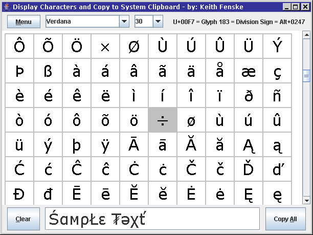

### Character Map (Java)

by: Keith Fenske, https://kwfenske.github.io/

CharMap is a Java 5.0 graphical (GUI) application to display Unicode characters
or glyphs in text fonts, and copy those characters to the system clipboard. Its
major purpose is as a visual accessory for word processors such as Microsoft
Word. This Java application can be resized, for text and the program window,
which is important in many languages. Features are limited to make the
application faster and simpler to use. A single click adds a character to the
sample text, and the sample text is automatically copied to the system
clipboard on each click.

A plain text file called CharMap4.txt is expected to be in the current working
directory with mappings from Unicode character numbers to caption strings. You
may edit this file to produce whatever captions you wish. Please read comments
in the file for further instructions. Common readings or sounds are given for
Chinese, Japanese, and Korean characters. Cantonese is prefixed with "C",
Japanese "Kun" with "J", Korean with "K", Mandarin with "M", and Sino-Japanese
"On" with "S". An English translation of CJK character definitions would have
been more amusing but less practical.

Download the ZIP file here: https://kwfenske.github.io/character-map-java.zip

Released under the terms and conditions of the Apache License (version 2.0 or
later) and/or the GNU General Public License (GPL, version 2 or later).

